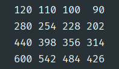

# Assignment 01

Name: Haopeng Chen

Student ID: 120090645

### 2. Basics Operations of Vectors and Matrices

#### 2.1 Basic Vector Operations

1.   
   
2. 
3. 

#### 2.2 Basic Matrix Operations

1.   
   
2. 
3. 
4. 

#### 2.3 SVD Decomposition of "lenna"

3. 
4. 
5. 
6. The resolution goes up as we take more singular values into compute. As we make the $\text{img} = U*S*V^T$, the number of singular values controls the size of $S$, affecting the size of $V$ as well. According to the lecture notes, $S$ is the actual matrix used for axis-aligned scaling. In this case, reducing the size of $S$ is try to combine the information of different vertical or horizontal lines into the same one. We find that SVD decomposition could be applied to image compression, reducing the file size without much quality lost.

#### 2.4 Basic Transformation Operations

