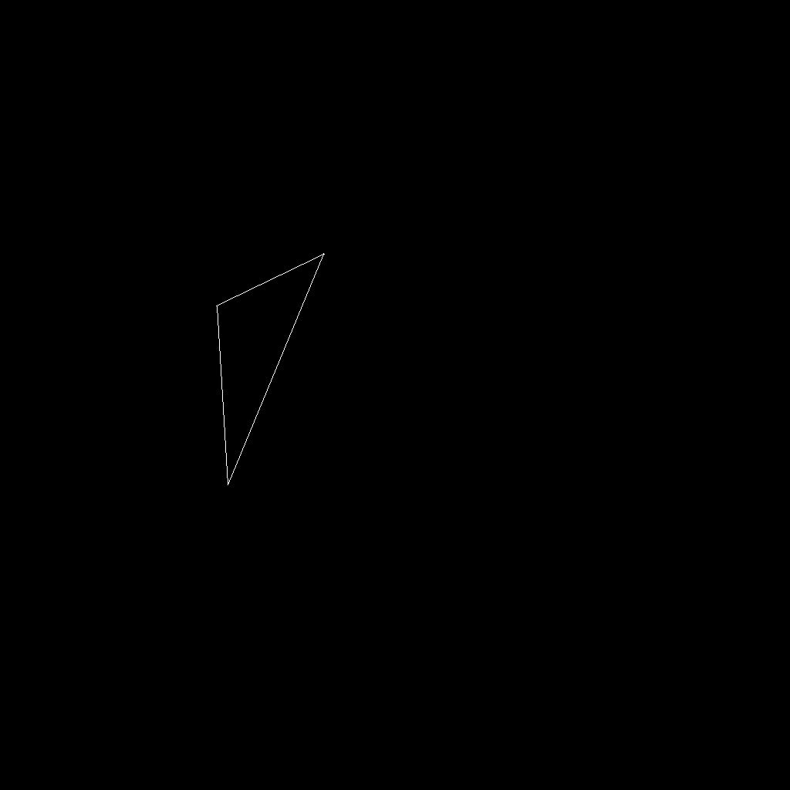

# Report

***Customize Details:***

eye position -> (0, 0, 10)

triangle -> ((2, 0, -2), (0, 2, -2), (-2, 0, -2))

eye_fox -> 60

aspect_ratio -> 1

zNear -> -20

zFar -> -80

translation vector -> (0, 0, 0)

scale vector -> (1, 1, 1)

P0 -> (0, 0, 0)

P1(1, 1, 1)

## Exampled Results

### 30 Degrees

### 60 Degrees

### 90 Degrees

### 120 Degrees

### 150 Degrees

### 180 Degrees

## Implementation

`Eigen::Matrix4f get_model_matrix()`:

1. For `M_trans` and `S_trans`, just follow the textbook and formula to make a homogeneous matrix.
2. Similarly, we can get rotation matrix, but need more attention for radian transfer.
3. Use `cout` for check. Do not use `assert` due to precision problems.

`Eigen::Matrix4f get_orthogonal_matrix()`:

​	As reference for textbook, it is helpful to get perspective projection matrix.

`Eigen::Matrix4f get_projection_matrix()`:

​	As reference for textbook, we can divide it into sub questions for different matrix. And we multiply them at last.