# CSC4140 Assignment3

Haopeng Chen 120090645

## Task 1

First, use bounding box method to determine rasterization area. Then, use cross product to find the accurate position of each point (in/out) triangle. That is, the product of vectors from each point of the triangle to the target point with the vectors of triangles must be all positive or negative. At last, `rasterize_point` point by point.

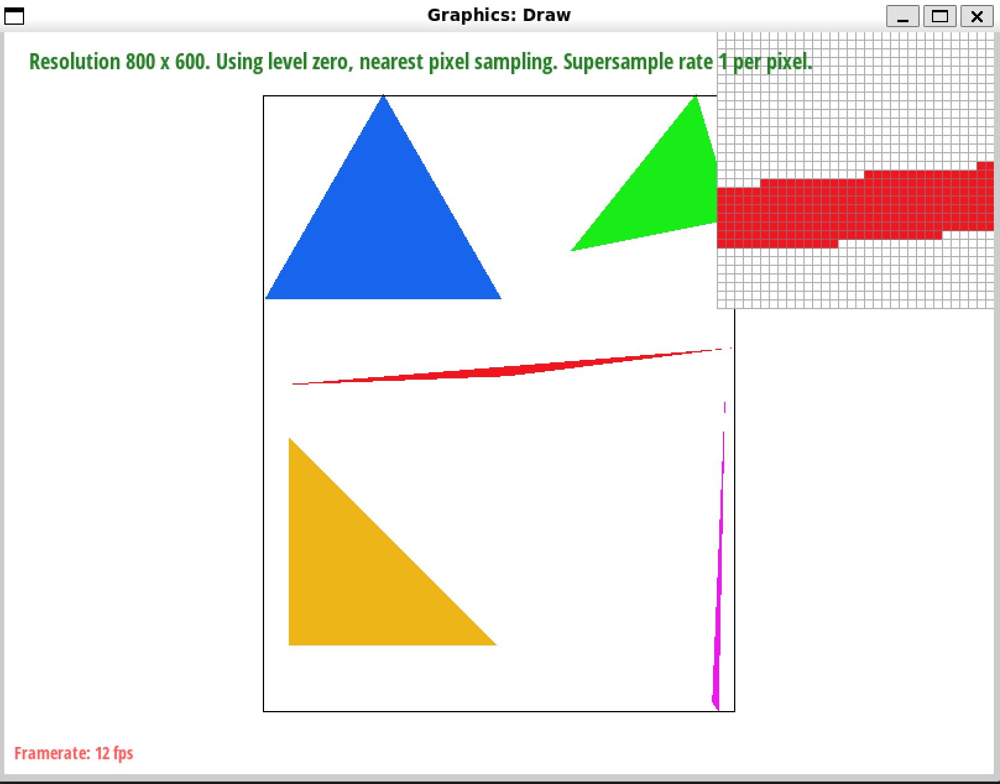

## Task 2

Supersampling is useful as it adopts convolution to pixel. On jaggies, convolution makes the edges become vague, leading to smoother lines. Instead of making adaptations everywhere, I basically implement the pipeline inside `rasterize_triangle`, making convolution to pixel points one by one in the bounding box intuitively.

Left to right: 1x, 4x, 16x (sample rates).

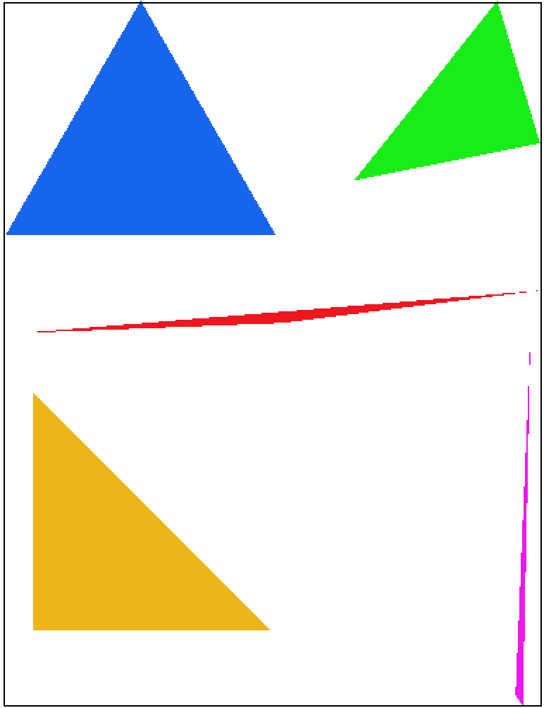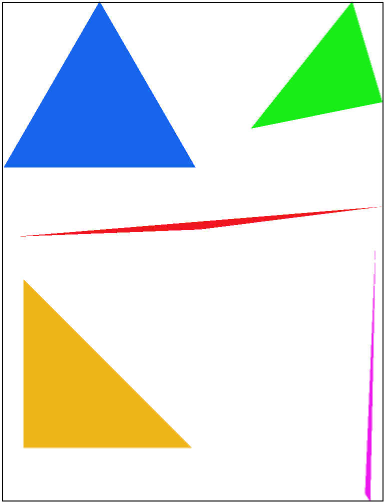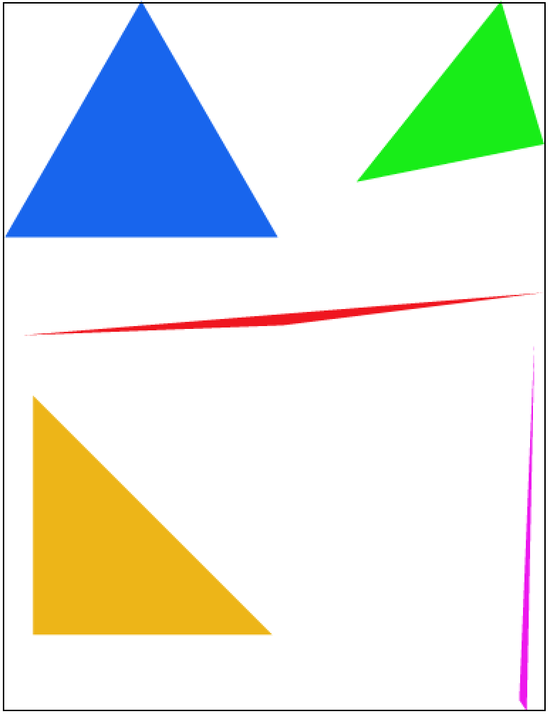

## Task 3

Do not familiar with front end things. No modification here.

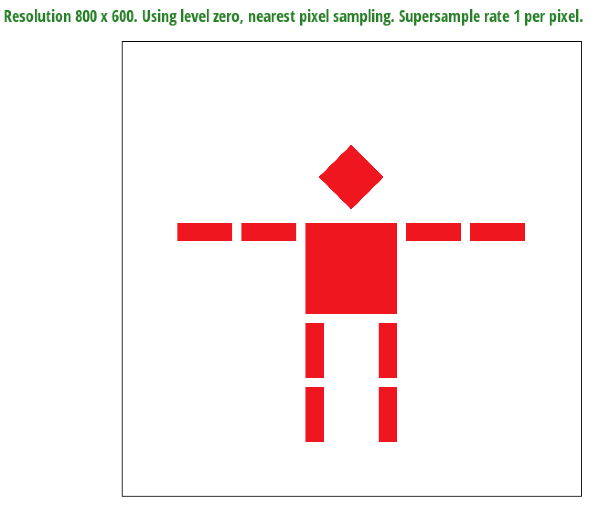

## Task 4

Barycentric coordinates could be considered as a transformation from 2D space (screen plane) into 3D space (RGB). The most important part is to use linear algebra knowledge to find the transformation matrix. 

From another perspective, it could also be considered as a 2D space (screen plane) mapping into 1D (line) problem. That is, we consider RGB as three independent channels and to find out their distribution separately.

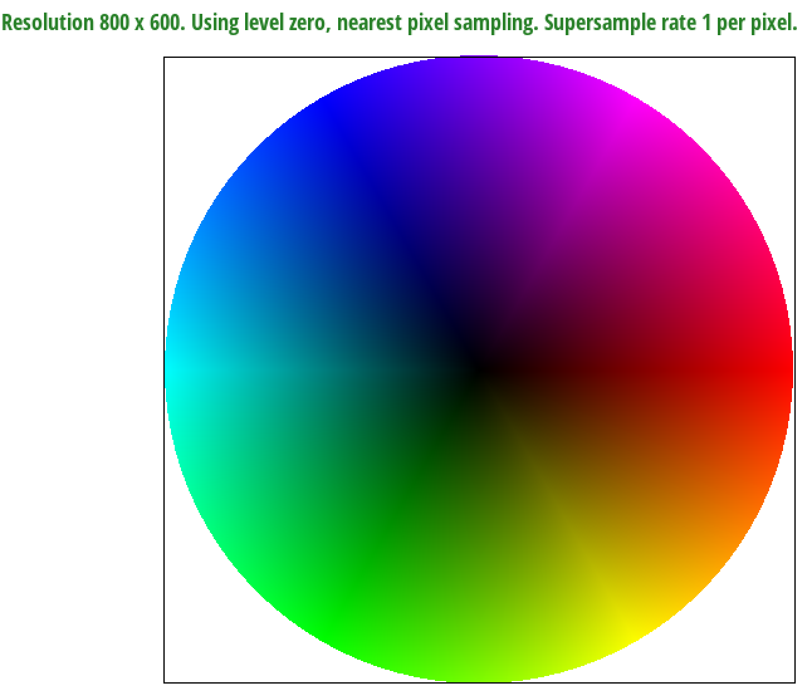

## Task 5

Pixel sampling is like color sampling, which is that the color is substitute by the pixel color after transformation of texture coordinate. Nearest sampling adopts the nearest pixel point for the pixel color, leading to mosaics in high resolution. Bilinear sampling use kind of average number to predict the color of that missing pixel point.

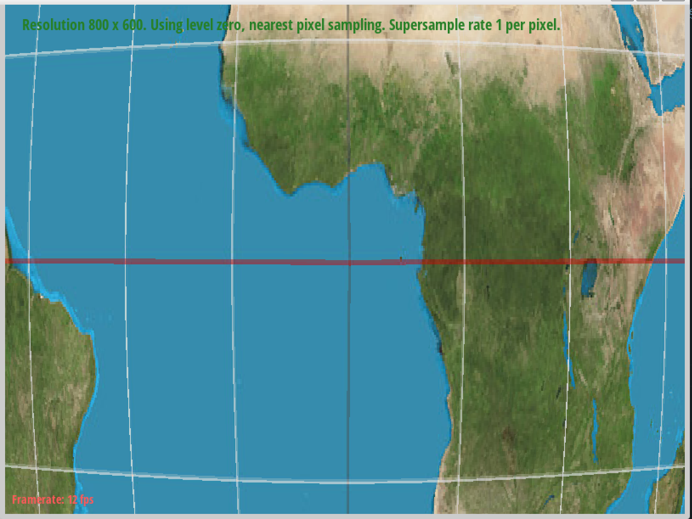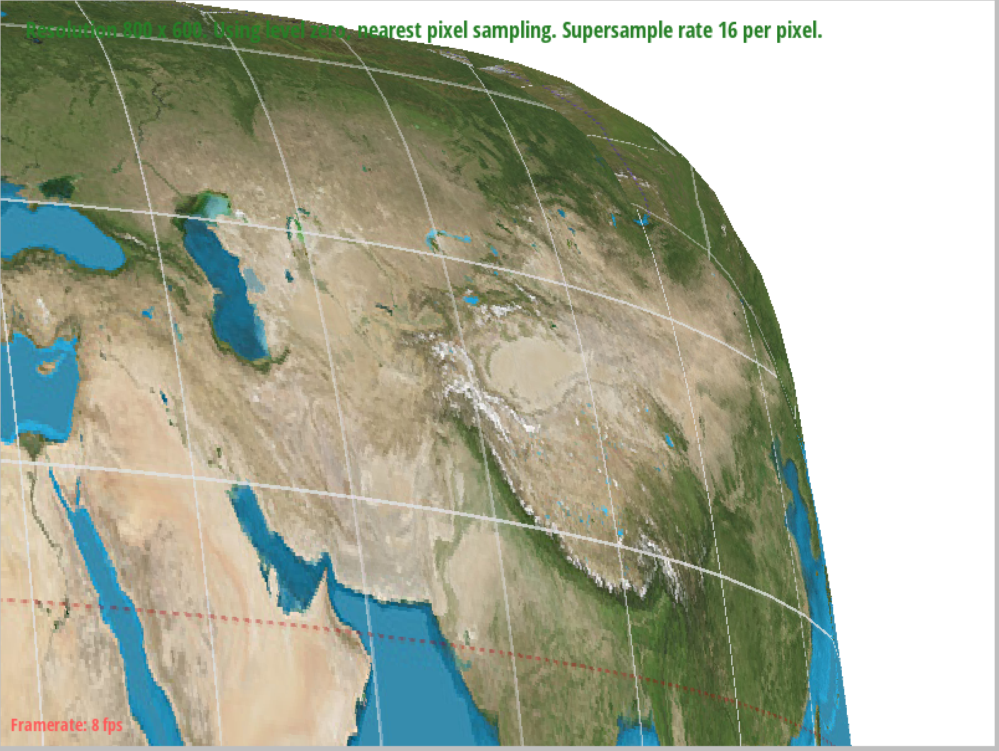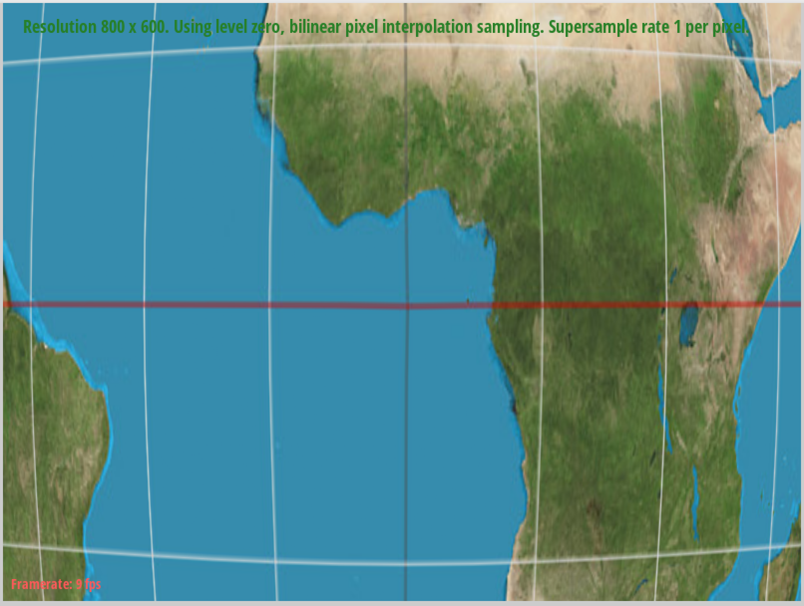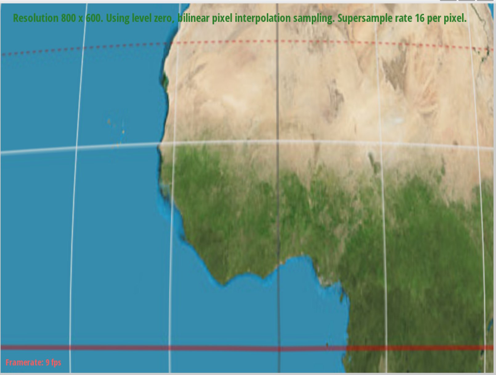

## Task 6

Level sampling is something for improve performance. We can choose to one by one mapping, four to one mapping etc.. We could also use convolution like operations to make it look smooth.

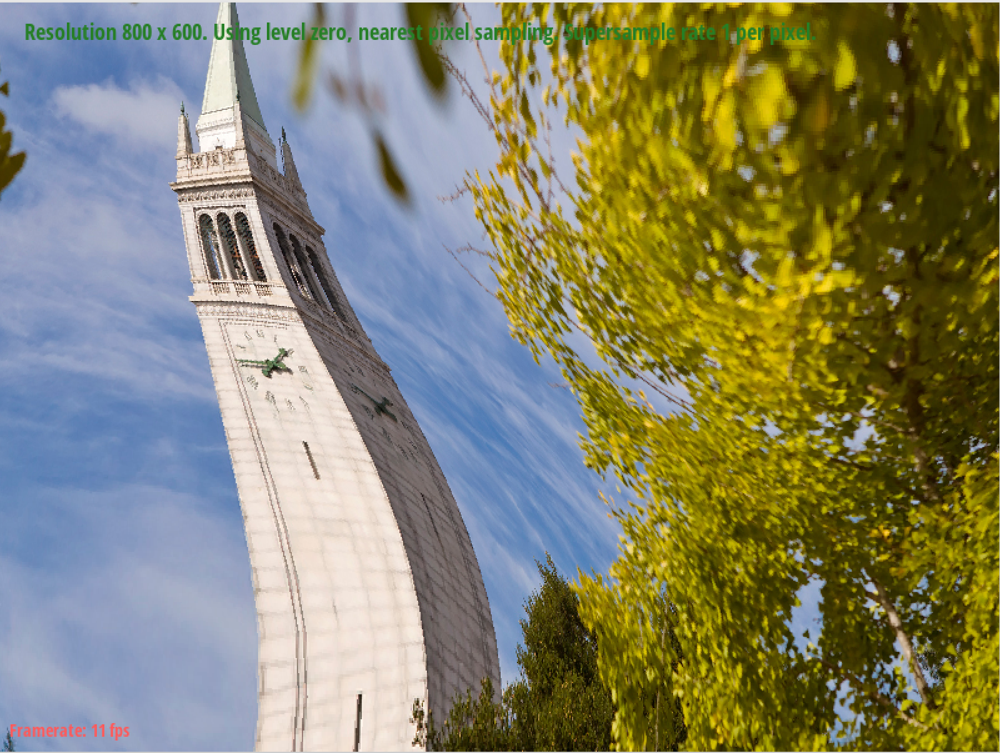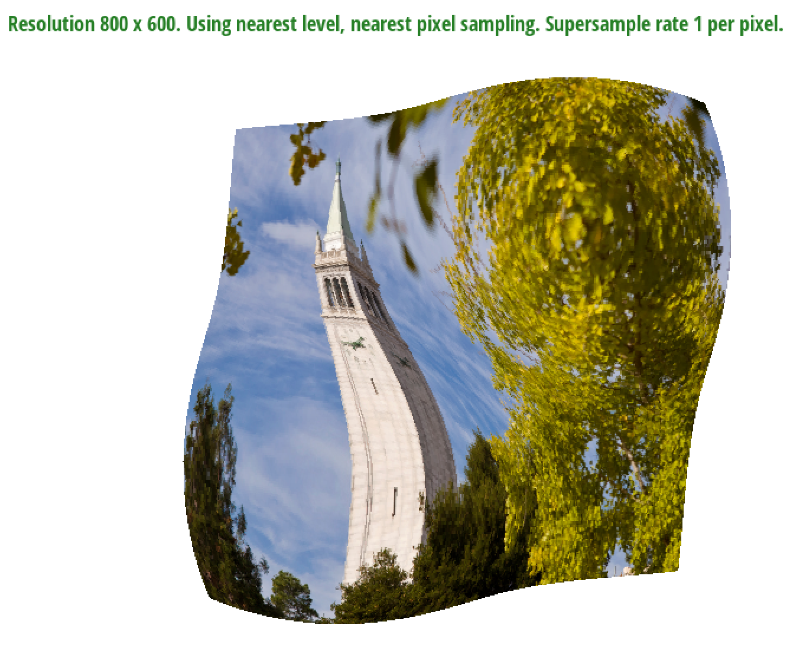
