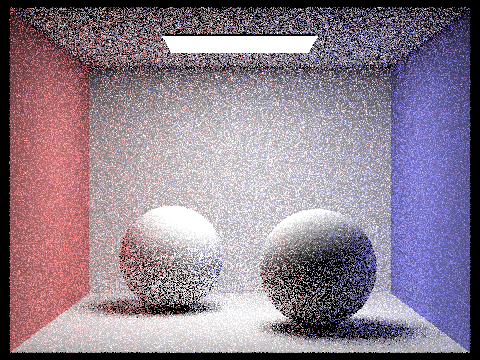

# Assignment 5

Haopeng Chen 120090645

## Part 1

From a camera to emit many random rays through a pixel, use the *Moller-Trumbore* algorithm to test for intersection
with triangles.

### Images

## Part 2

We always pick the longest axis of the bounding box as the splitting axis. We can use the middle value of the centroids
of the bounding boxes to pick the splitting point.

### Images

## Part 3

In raw direct lightning, we generate rays from object to lights, which has small probability to hit and leads to much
noise.
If we change to generate rays from light to object, we can get a better result.

### Images
**light samplings**

**uniform hemisphere samplings**

## Part 4

In indirect lightning, we combine reflection from object and diffuse lightning from light. We can use the *Russian
Roulette* to
control the probability of reflection. 

### Images
**different `may_ray_depth`**

**different sample per pixel rates**

## Part 5
We check the error per batch, and if the error is under max tolerance. We stop the iteration.

### Images

