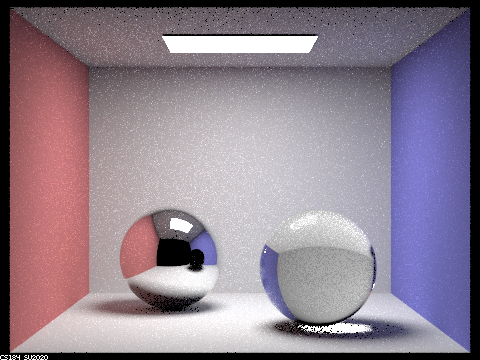

# Assignment 6
120090645

Haopeng Chen

## Part I
$Depth = 0$, we can only receive light from source.

$Depth = 1$, now we can receive lights from one reflect.

$Depth = 2$, now we can see the mirror phenomenon of the sphere. 

$Depth = 3$, the refraction inside the sphere can reach the camera at last.

$Depth = 4$, the flare at the right corner of the blue wall.

$Depth = 5$

$Depth = 100$

## Part III
***The jpg of field***

***The probability debug image of field***

***bunny_unlit, uniform sampling***

***bunny_unlit, importance sampling***

***bunny, uniform sampling***

***bunny, importance sampling***

**Summary**: The noise of *importance sampling* is much smaller than *uniform sampling* since we check the intersection at the source to avoid meaningless rays.

## Part IV

**Differences between a pinhole camera model and a thin-lens camera mod

1. Design: In a pinhole camera, light passes through a small hole (or aperture) and forms an inverted image on the opposite side of the camera. In contrast, a thin-lens camera uses a lens to refract light and form an image on the opposite side of the lens.
2. Image formation: The pinhole camera model assumes that light travels in straight lines and the image is formed by the intersection of these lines with the image plane. In contrast, the thin-lens camera model assumes that light travels in curved paths through the lens and the image is formed by the refraction of light at the lens surface.
3. Depth of field: The pinhole camera model has an infinite depth of field, meaning that objects at different distances from the camera will all be in focus. In contrast, the thin-lens camera model has a limited depth of field, meaning that objects at different distances from the lens will only be in focus if they are within a certain range of distances.
4. Distortion: The pinhole camera model produces images that are free from distortion, while the thin-lens camera model can introduce distortion due to the curvature of the lens surface.

#### Different Depths
***depth = 4***

***depth = 4.5***

***depth = 5***

***depth = 6***

#### Different Apertures
***aperture = 0.1***

***aperture = 0.2***

***aperture = 0.3***

***aperture = 0.4***

