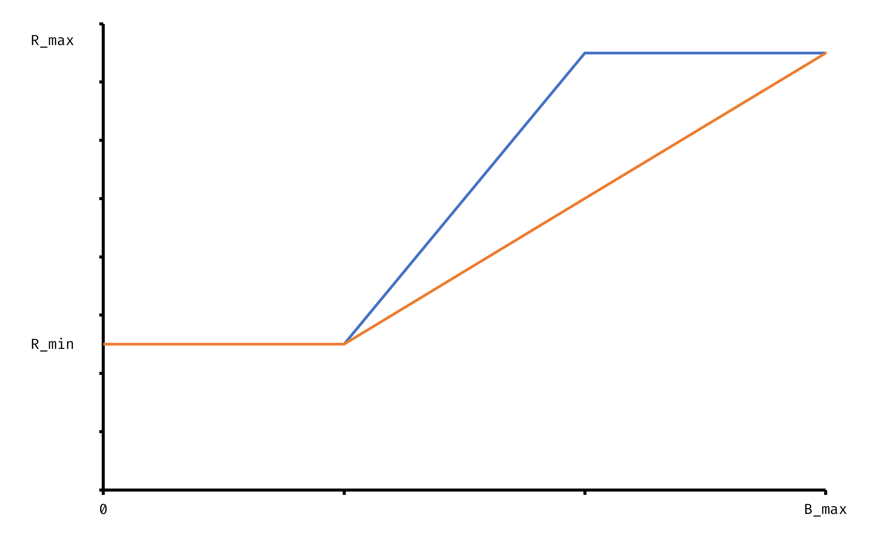
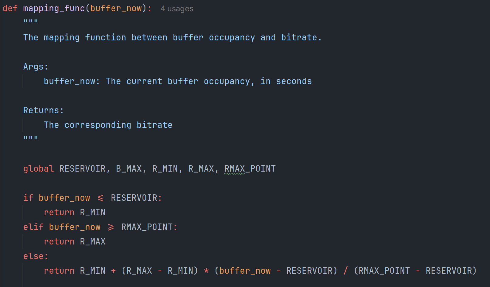
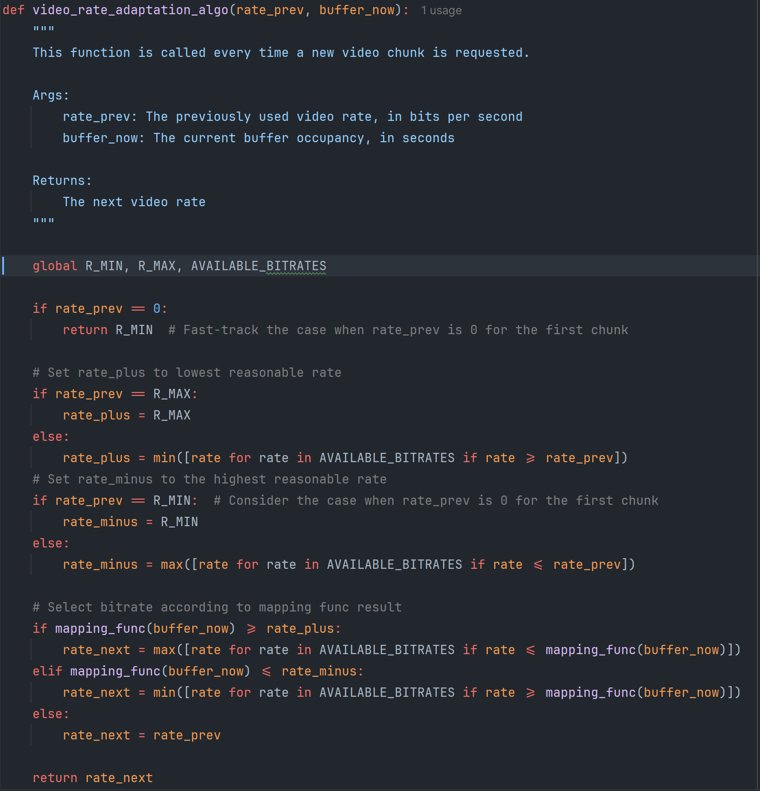

# Report

ID: 120090645

Name: Haopeng Chen

Selected Paper: Te-Yuan Huang, Ramesh Johari, Nick McKeown. ***Downton Abbey Without the Hiccups: Buffer-Based Rate Adaptation for HTTP Video Streaming***.

## Algorithm Analysis

Algorithm: Video Rate Adaptation Algorithm

```Python
Hyperparameters:
    R_M: All available bitrates, bits per second
    R_max: Maximum available bitrate, bits per second
    R_min: Minimum available bitrate, bits per second
    R_i: i-th available bitrate inside R_M, bits per second
    mapping_func: a mapping function to transfer buffer occupancy to designated bitrate mathematically.

Input: 
	Rate_prev: The previously used video rate, bits per second
	Buf_now: The current buffer occupancy, second

Output: 
	Rate_next: The fetched video rate, second

# Select adjacent possible values from R_M, larger and smaller respectively
if Rate_prev == R_max:
	Rate_plus = R_max  # Could not increase any more
else:
	Rate_plus = min{R_i : R_i > Rate_prev}  # next larger step
if Rate_prev == R_min:
	Rate_minus = R_min  # Could not decrease any more
else:
	Rate_minus = max{R_i : R_i < Rateprev}  # next smaller step

# Check the mapping function to see whether should move up/down to next step. If so, move to the step nearest to the bound, skipping intervals (if exists).
if mapping_func(Buf_now) >= Rate_plus:
	Rate_next = max{R_i : R_i < mapping_func(Buf_now)}
elif mapping_func(Buf_now) <= Rate_minus:
	Rate_next = min{R_i : R_i > mapping_func(Buf_now)}
else
	Rate_next = Rate_prev

return Ratenext
```

### Mapping Function

The orange line represents the naive implementation from the paper, while the blue line is my enhanced version. By selecting the `R_max` at lower buffer occupancy, a.k.a. `B_t`, we are able to achieve higher average bitrate. According to the paper, the plain part for small `B_t`, **reservoir**, is with the length of $V\times \frac{R_{\text{max}}}{R_{\text{min}}}$, where $V$ is the duration of a chunk.



I set the upper plain part with the length of **twice** as **reservoir** if possible. If this is not a valid value, it will try to find the most nearest valid one, moving to `B_max` one by one. This enhanced mapping function gives better performance, especially on good network condition (faster convergence).

## Implementation





## Evaluation

| Naive / Mine     | Avg. Bitrate      | Buffer Time   | Switches | Score             |
| ---------------- | ----------------- | ------------- | -------- | ----------------- |
| badtest          | 2166666 / 633333  | 73 / 1        | 23 / 1   | 7518 / 553192     |
| testALThard      | 2166666 / 633333  | 72 / 1        | 22 / 1   | 8535 / 553504     |
| testALTsoft      | 3816666 / 1583333 | 27 / 0.202    | 10 / 2   | 407852 / 1326319  |
| testHD           | 4566666 / 1583333 | 0.202 / 0.202 | 2 / 2    | 3825384 / 1326319 |
| testHDmanPQtrace | 50000 / 50000     | 242 / 242     | 0 / 0    | 0.197 / 0.197     |
| testPQ           | 50000 / 50000     | 246 / 246     | 0 / 0    | 0.162 / 0.162     |

This is the comparison table between the example code and my implementation. We can easily find out the last two row share the same statistics, which means that they perform similarly under bad network condition. As for the first three ones, they indicate that my implementation outperform the given one on fluctuated network. For the HD test, it shows that my implementation does not achieve the highest bitrate as quick as the given one.